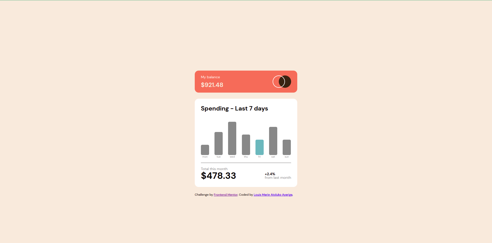

# Frontend Mentor - Expenses chart component solution

This is a solution to the [Expenses chart component challenge on Frontend Mentor](https://www.frontendmentor.io/challenges/expenses-chart-component-e7yJBUdjwt). Frontend Mentor challenges help you improve your coding skills by building realistic projects.

## Table of contents

- [Overview](#overview)
  - [The challenge](#the-challenge)
  - [Screenshot](#screenshot)
  - [Links](#links)
- [My process](#my-process)
  - [Built with](#built-with)
  - [What I learned](#what-i-learned)
  - [Continued development](#continued-development)
  - [Useful resources](#useful-resources)
- [Author](#author)
- [Acknowledgments](#acknowledgments)

**Note: Delete this note and update the table of contents based on what sections you keep.**

## Overview

### The challenge

Users should be able to:

- View the bar chart and hover over the individual bars to see the correct amounts for each day
- See the current day’s bar highlighted in a different colour to the other bars
- View the optimal layout for the content depending on their device’s screen size
- See hover states for all interactive elements on the page
- **Bonus**: Use the JSON data file provided to dynamically size the bars on the chart

### Screenshot

### Links

- Solution URL: [github](https://github.com/almamarie/HTML-CSS-Expenses-chart-component.git)
- Live Site URL: [Add live site URL here](https://your-live-site-url.com)

## My process

### Built with

- Semantic HTML5 markup
- CSS custom properties
- Flexbox
- CSS Grid
- Mobile-first workflow
- JavaScript

### What I learned

I learned a lot about manipulating CSS styles with JavaScript. I also learned how to simulatue mouse hover events with the JavaScript DOM event listener.

### Continued development

I have found it difficult loading json data from a file because of the async await I had to use. This has confused me a lot and I need to research more on it. I also need to learn how to create graphs with JavaScript. Finally, I need to get conversant with all the Javascript event listeners.

The final area to work on is positioning elements. I struggled with this so much that I couldn't add it to the solution as the challenge required. I need to learn more about this

## Author

- Website - [Louis Marie Atoluko Ayariga](www.linkedin.com/in/marieloumar)
- Frontend Mentor - [@almamarie](https://www.frontendmentor.io/profile/yourusername)

## Acknowledgments

My greatest thanks goes to [Jonas Schmedtmann](https://codingheroes.io/) for his great tutorial that has taught me everything I need to know as a beginner. What I learned from his HTML and CSS course is what has helped me to complete this challenge.
